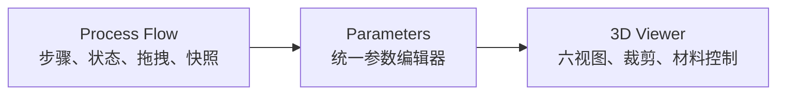
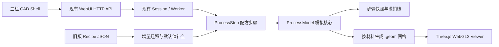
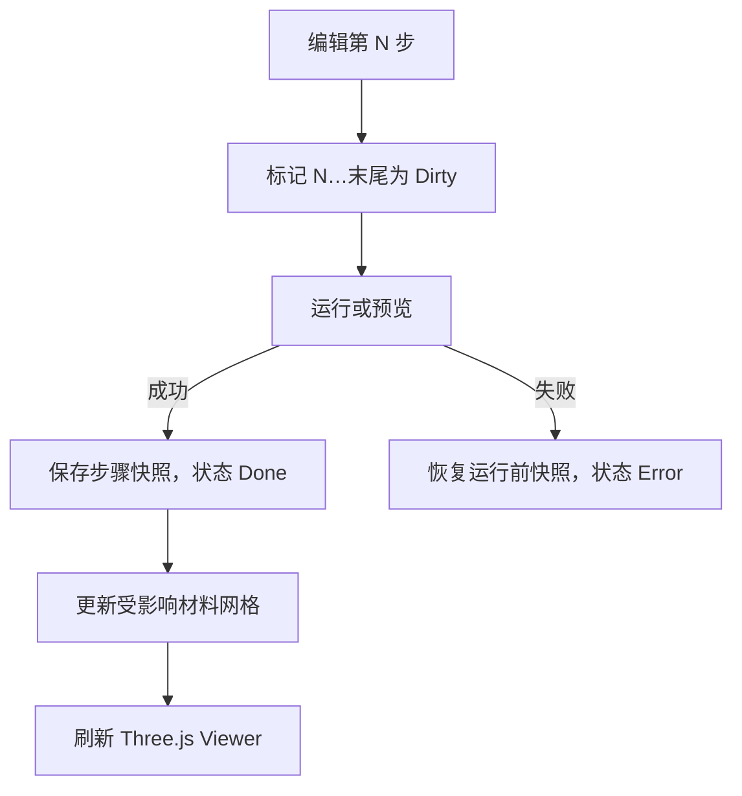

# TCAD Process CAD Shell 设计说明

- 日期：2026-08-25
- 状态：已完成交互评审，待文档复核
- 目标里程碑：Milestone 1 — Process CAD Shell
- 实现策略：在现有架构上增量扩展，不重写模拟器

## 1. 背景与目标

TCAD-Simulator 已经具备较完整的体素工艺模拟、配方执行、桌面 GUI、WebUI、快照、网格导出与 3D 预览能力。Milestone 1 不重新实现这些能力，而是把已有能力整理成一个适合工艺工程师使用的 Process CAD 工作面，并补齐首个闭环所缺少的工艺语义、视图控制和可验证性。

本里程碑的产品目标是：用户可在同一界面中编辑工艺流程、调整选中步骤的参数、运行或回看任意有效步骤，并在真实 3D 几何中检查材料堆叠、截面和工艺结果。

界面采用中文为主、保留专业英文术语的表达方式，例如 Deposition、Etch、CMP、ALD 和 WebGL2。

## 2. 已有架构审计

### 2.1 代码与运行结构

当前项目以 `tcad_simulator.py` 为规范实现，文件约 10 万行。`split_tcad.sh` 与 `tools/split_tcad.py` 能生成便于导航的拆分视图，但拆分目录不是规范源码。

主要模块边界如下：

| 区域 | 当前职责 | 结论 |
| --- | --- | --- |
| `MaterialDatabase` / `Material` | 材料物性、颜色与材料 ID | 保留；视觉属性另建兼容层 |
| `ProcessModel` | 体素状态和工艺物理操作 | 保留为唯一模拟真相源 |
| `ProcessStep` 子类 | 配方参数定义与 `ProcessModel` 调用 | 保留为统一配方接口 |
| `SimulatorController` / PyQt5 | 桌面端编辑与执行 | 保持兼容，不作为本里程碑主界面 |
| WebUI Session / Worker | 多会话、配方执行、快照、预览数据 | 保留并增量扩展 |
| 内嵌 HTML/CSS/JS | 当前 WebUI 与 Three.js Viewer | 增量形成 CAD Shell，不引入框架重写 |

### 2.2 已验证能力

| 能力 | 状态 | 现有实现 |
| --- | --- | --- |
| 衬底初始化 | 已有 | `InitializeWaferStep`、`ProcessModel.build_substrate` |
| 光刻胶、曝光、显影、PEB | 已有 | 对应 `ProcessStep` 子类和掩膜链路 |
| GDS 掩膜导入 | 已有 | 掩膜加载与层选择链路 |
| Deposition | 已有 | CVD、ALD、PVD、Epitaxy、Electroplate 与通用沉积 |
| Conformal / Directional deposition | 已有 | ALD/CVD 覆盖与 PVD directionality 参数 |
| Etch | 已有 | 干法、湿法、各向同性、方向性与材料选择比 |
| CMP | 已有 | `CMPStep` 与 `ProcessModel.cmp` |
| Implant / Anneal | 已有 | 离子注入、退火及相关物理场 |
| Oxidation / Nitridation | 已有 | 氧化/氮化步骤与生长模型 |
| 配方 JSON | 已有 | 序列化、反序列化和版本迁移 |
| 快照、Undo、Run-to | 已有 | 每步快照、恢复、磁盘溢出与增量重跑 |
| 3D 网格 | 已有 | 按材料 marching-cubes、面数预算、`.geom` 缓存 |
| 材料显隐与颜色覆盖 | 部分已有 | 浏览器本地状态，尚无统一视觉注册表 |
| 3D 裁剪 | 部分已有 | WebGL 下最多两个与切片联动的裁剪面 |
| 工艺时间线 | 部分已有 | 内部快照存在，缺少 Previous/Next/任意跳转产品交互 |

### 2.3 缺口与已定位问题

1. 浏览器实际可能回退到 Host Render。原因是 `_webglAvailable(canvas)` 在真实 viewer canvas 上先创建 WebGL1 context，Three.js 随后尝试 WebGL2 时发生 context 类型冲突。
2. Host Render 不支持当前 3D cutaway，因此该回退同时让裁剪能力不可用。
3. 当前 Process Recipe 与 Step Parameters 位于同一左侧 dock 的不同标签中，不符合固定三栏工作流。
4. 配方列表只有上移/下移按钮，缺少真正的拖拽排序、步骤重命名和明确执行状态。
5. Viewer 缺少 TOP、BOTTOM、FRONT、BACK、LEFT、RIGHT、ISO 标准视图以及 Perspective/Orthographic 切换。
6. 裁剪面尚不能对 X/Y/Z 三轴独立启用和反向裁剪。
7. 缺少 Strip、Fill、Wafer Flip、Bonding、Thinning 等独立步骤语义。
8. 材料物理属性和显示属性没有清晰边界；透明度、粗糙度、金属度和默认可见性未统一管理。
9. 当前示例配方不能覆盖 Basic Trench、Spacer Formation 和 Bonding + Thinning 三个验收场景。
10. `tcad_simulator.py`、WebUI Worker 和内嵌前端代码体量过大。Milestone 1 不做全面拆分，但新增逻辑必须保持边界清晰、可测试，并避免继续复制工艺逻辑。

## 3. 方案选择

### 3.1 备选方案

#### A. 在现有标签界面上补丁式增加控件

优点是改动最小；缺点是 Process Flow、Parameters 和 Viewer 无法同时成为稳定的 CAD 工作面，交互债务会继续累积。

#### B. 增量 CAD Shell（采用）

保留 HTTP/Worker、`ProcessStep`、`ProcessModel`、Recipe JSON 和网格管线，重组浏览器壳层并新增缺少的薄语义步骤。该方案能在控制迁移风险的同时交付完整工作流。

#### C. 新建 React/Vite 前端

长期模块化更强，但会扩大构建依赖、部署路径和 API 迁移面，接近前端重写，不适合当前里程碑。

### 3.2 选择理由

采用方案 B。它遵守“不重写项目”的约束，同时允许把最影响使用的 WebGL、布局、视图与工艺闭环问题一次解决。Milestone 1 暂不引入新的前端框架或 Node 构建要求。

## 4. 目标界面

### 4.1 固定三栏布局



左栏宽度以 280–320 px 为目标，中栏以 320–380 px 为目标，右栏占据剩余空间。首版面向不小于 1280 px 的桌面浏览器；窄窗口允许面板折叠，但不以手机布局为验收目标。

### 4.2 Process Flow

每个步骤卡显示：序号、可编辑名称、步骤类型、关键参数摘要、启用状态和执行状态。支持：

- Add、Duplicate、Delete；
- 原生拖拽排序，并保留键盘/按钮排序作为可访问性后备；
- 单击选中并同步中栏参数；
- `Ready / Dirty / Running / Done / Error` 状态；
- Previous、Next、Run Selected、Run To、Run All；
- 快照位置和后续失效范围提示。

### 4.3 Parameters

继续使用 `ProcessStep.parameter_specs()` 作为参数 UI 的来源，避免另建一套参数模型。新增参数类型或展示元数据时采用向后兼容字段。

参数采用自动保存，但分为两层：

1. 输入合法时立即保存配方值并把当前步骤及其后续标记为 Dirty；
2. 输入不合法时保留编辑态，显示字段错误，不写入 Worker 中的有效配方。

### 4.4 3D Viewer

Viewer 提供：

- ISO、TOP、BOTTOM、FRONT、BACK、LEFT、RIGHT；
- Perspective 与 Orthographic camera；
- Fit、Reset、Orbit、Pan、Zoom；
- X/Y/Z 三个独立裁剪面，每个包含启用、位置和 invert；
- 材料显隐、颜色和透明度；
- 坐标轴、网格、当前 revision、面数和后端状态；
- WebGL2 初始化失败时的可见降级提示。

相机、材料显示、透明度和裁剪交互必须在浏览器本地完成，不因视图操作触发 Worker 重算或重新下载几何。

## 5. 数据流与兼容策略



### 5.1 Recipe 兼容

- Recipe JSON 只增加可选字段和版本迁移，不删除或改变旧字段语义。
- 旧配方没有步骤实例名时，继续以步骤类型名称显示。
- 新增的实例名、视觉配置和 UI 状态不改变 `ProcessStep` 的物理执行参数。
- 所有旧步骤仍通过现有工厂和迁移逻辑构造。
- 保存后再次加载必须保持步骤类型、参数、顺序、启用状态和实例名。

### 5.2 快照失效

编辑第 N 步后：

- 第 0 到 N-1 步的兼容快照保留；
- 第 N 步到末尾标记为 Dirty；
- 回看前序快照不触发重算；
- 执行 N 或更后步骤时，从最近有效快照恢复并增量计算；
- 步骤顺序变化时，从最早受影响的位置开始失效。

### 5.3 几何缓存

继续使用现有按 material/revision/face-limit 生成 `.geom` 的机制。浏览器每个材料只持有一份 `BufferGeometry`，实体与透视 mesh 共享 geometry，只切换 material 和 visibility。

Milestone 1 增加按材料的变化标记；若无法可靠确定变化材料，则安全地回退到当前 revision 全材料 manifest 更新，但不得退化为每体素创建 cube。

## 6. 新工艺语义

新增步骤仍继承 `ProcessStep`，只负责参数验证、迁移和调用 `ProcessModel`；体素变换必须位于 `ProcessModel` 或可测试的模型辅助函数中。

### 6.1 Strip

选择一个或多个目标材料，从模型中移除匹配体素。首版支持全局 strip 和从暴露表面连通区域 strip；默认用途是 O₂ Plasma 去胶。不会通过伪造极高 Etch rate 来实现。

### 6.2 Fill

从指定暴露方向对连通 void 区域填充目标材料，可设置目标高度、最大深度和是否仅填充封闭/开口结构。首版描述几何填充结果，不模拟流体动力学。

### 6.3 Wafer Flip

沿 Z 方向翻转整个材料网格，并同步翻转与体素共址的物理场、缺陷场和组分场。翻转后重新规范化有效堆叠位置，并记录当前 active side，供后续 Bonding 和 Thinning 使用。

### 6.4 Bonding

首版采用单模型晶圆堆叠语义：在当前 active side 附加指定厚度和材料的 handle wafer，并可插入键合层。它不扩展为两个独立 `ProcessModel` 的多晶圆求解器。接口预留 source 描述，以便后续支持外部晶圆状态。

### 6.5 Thinning

从当前 backside 移除材料，直到达到目标剩余厚度或移除厚度。方向由 Wafer Flip/active side 状态决定，不假定永远从数组同一端减薄。

## 7. MaterialVisual 注册表

新增统一视觉记录：

```text
MaterialVisual
  material_id
  display_name
  color
  opacity
  metallic
  roughness
  visible
```

视觉记录与材料物理属性分离。未配置时从现有 `Material.name` 和 `Material.color` 生成默认值。Recipe 中只保存显式覆盖；旧 Recipe 不受影响。

## 8. WebGL 与相机设计

### 8.1 初始化修复

WebGL 能力探测使用临时 canvas，不接触真实 viewer canvas。真实 canvas 只交给一次 `THREE.WebGLRenderer` 初始化，优先 WebGL2。初始化失败后销毁未完成资源，再显式启用 Host Render，并在状态栏显示原因。

### 8.2 标准视图

标准视图根据模型包围盒中心和尺寸计算 camera position、up 和 near/far。Perspective/Orthographic 切换保持 target 和可见尺度，避免切换后模型跳出视口。

### 8.3 三轴裁剪

每个轴维护独立 `THREE.Plane`、enabled、position 和 invert 状态。所有使用中的材质共享同一组 clipping plane 引用。切换材料显示模式时不得丢失裁剪状态。

## 9. 执行状态、错误与回滚



每一步按事务边界执行：运行前确保存在可恢复状态；成功后提交模型 revision 和快照；失败时恢复模型、revision 和有效缓存指针。

结构化错误至少包含：

- 步骤索引、实例名和步骤类型；
- 参数路径（如可确定）；
- 用户可读消息；
- 原始异常类型和调试详情；
- 建议操作；
- 是否已经成功回滚。

WebGL 初始化失败、Host Render 降级、内存预算接近上限和网格面数被压缩均显示可见状态，不静默处理。

## 10. 示例配方

### 10.1 Basic Trench

Initialize Wafer → Oxidation → Spin Resist → Mask Exposure → Develop → Anisotropic Etch → Strip。

验收重点：光刻链路、方向性刻蚀、去胶、截面和步骤回看。

### 10.2 Spacer Formation

Initialize Wafer → Core Deposition/Pattern → Conformal ALD → Directional Etch-back → Strip/Selective removal。

验收重点：共形沉积、方向性刻蚀和侧墙 spacer 几何。

### 10.3 Bonding + Thinning

Initialize Wafer → Front-side structure → Wafer Flip → Bonding layer → Bond handle wafer → Thinning。

验收重点：active side、物理场同步翻转、键合堆叠和背面减薄。

## 11. 验证策略

### 11.1 自动测试

1. Recipe 兼容：旧 JSON 加载、迁移、保存、重载与字段等价。
2. 工艺原语：在小尺寸网格上分别测试 Strip、Fill、Flip、Bonding 和 Thinning。
3. 物理场一致性：Flip 后材料、掺杂、缺陷和组分位置一致。
4. 快照：编辑失效范围、Previous/Next、Undo/Redo 和失败回滚。
5. 示例配方：三个 demo 以 headless 模式运行完成，并检查关键材料和包围盒。
6. Viewer：WebGL2 初始化、标准视图、camera 切换、三轴裁剪和 material visibility 的浏览器冒烟测试。

### 11.2 性能基准

以 128³ 网格记录：

- 各 demo 总运行时间；
- 峰值常驻内存；
- 快照磁盘占用；
- preview mesh 三角面数与生成时间；
- 首次 3D 加载和只改变相机/裁剪时的请求数量。

验收要求：相机、裁剪和材料显隐不触发 Worker 重算；网格仍按材料生成，不能退化为体素 cube。

### 11.3 已知基线问题

- 当前 `--recipe-io-selftest` 依赖仓库中缺失的 `SAQP_Thinking_Flow.json` 和旧版本参考文件。实现计划需要把该测试改为自包含 fixture，或明确提供受版本控制的测试数据。
- Shell 脚本当前没有可执行位；macOS 上需要 `bash split_tcad.sh`。该问题可作为低风险维护项修复。
- 当前前端和 Worker 均位于超大内嵌代码块中。Milestone 1 只做必要边界整理，全面模块化另列后续里程碑。

## 12. Milestone 1 验收标准

Milestone 1 完成需同时满足：

1. 浏览器默认成功使用 WebGL2；失败时显示可解释的 Host Render 降级状态。
2. Process Flow、Parameters 和 Viewer 在桌面宽屏同时可见。
3. 步骤可新增、复制、删除、重命名和拖拽排序。
4. 编辑参数只使当前及后续步骤失效，前序快照可立即回看。
5. 六视图、ISO、Perspective/Orthographic 和 X/Y/Z 独立裁剪可用。
6. MaterialVisual 统一控制显示名称、颜色、透明度、金属度、粗糙度和可见性。
7. Strip、Fill、Wafer Flip、Bonding 和 Thinning 有独立步骤、参数验证和自动测试。
8. 三个示例配方可 headless 运行，并在 WebUI 中展示逐步几何变化。
9. 旧 Recipe JSON 兼容测试通过。
10. Python 编译、自测、浏览器冒烟和 128³ 性能基准均有可复现结果。

## 13. 非目标与后续路线

Milestone 1 不包含：

- 重写 `ProcessModel` 或更换体素表示；
- 多个独立晶圆模型的全物理耦合求解；
- React/Vite 等新前端构建链；
- 移动端完整适配；
- 全面拆分 10 万行规范源码；
- 对所有工艺模型进行研究级物理标定。

建议后续路线：

1. Milestone 2：参数扫描、DOE、结构测量与结果比较；
2. Milestone 3：器件区域、电极、网格与电学求解接口；
3. Milestone 4：更严格的多晶圆装配、校准数据与可复现实验包；
4. 持续工程：逐步拆分 Worker、前端资源和模型子域，并建立稳定 CI。

## 14. 已确认决策

- 主界面：WebUI，不以 Xcode 或原生 macOS 应用作为主要开发路径；
- 展示方式：浏览器原型 + 纯文本说明 + Mermaid；
- UI：中文为主，保留专业英文术语；
- 布局：固定三栏 CAD Shell；
- 架构：增量扩展现有 HTTP/Worker、`ProcessStep` 和 `ProcessModel`；
- 兼容：旧 Recipe JSON 必须继续加载；
- 范围：包含工艺闭环、视图控制、快照回看、错误回滚和三个 demo。
