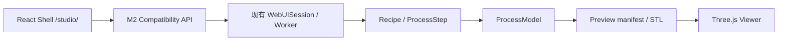
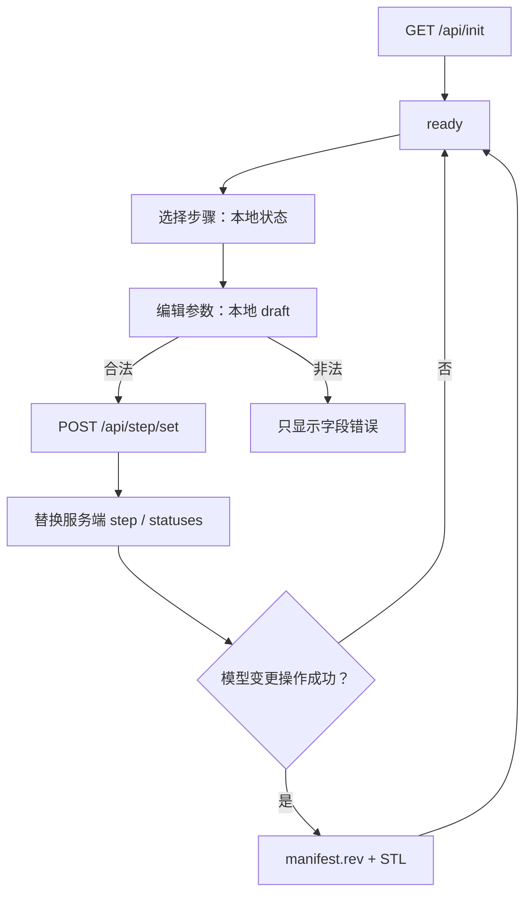

# M2 React Shell 设计说明

- 日期：2026-08-30
- 状态：已实现（M2 交付，实现尖端 `c47acdf`，详见 `docs/ROADMAP_PROCESS_CAD.md`）
- 目标里程碑：M2 — React Shell
- 基线提交：`063838ae9c829ad91ab67e9f5976bed18a3be07b`

## 1. 背景与目标

M1 已稳定现有 Process CAD Runtime，并用 5 套 Golden 流程锁定行为。M2 开始在
`frontend/` 中建设 React + TypeScript + Vite 并行客户端，但不删除或改写旧 WebUI。

本次交付采用「可运行垂直切片」，而不是只有静态占位的脚手架。用户可以在高密度三栏
工作台中加载真实会话、选择工艺步骤、编辑步骤参数、执行配方、回看 Timeline，并在右侧
拖拽、平移和缩放真实模型网格。

本次交付的成功标准如下：

1. React 客户端通过冻结的 M2 Compatibility API 使用现有 Worker 和 Session。
2. Process Flow、Parameters、Three.js Viewer 与 Timeline 形成可工作的高密度桌面工作台。
3. 参数编辑遵守 `parameter_specs()`、服务端校验和 Dirty 状态语义。
4. Viewer 加载真实材料网格，并提供 Orbit、Pan、Zoom、Fit 和 ISO 视图。
5. 旧 WebUI、Desktop、Headless、Recipe JSON 和 Golden 流程保持兼容。

## 2. 已确认决策

### 2.1 交付范围

采用已评审的「范围 B」：

- 建立 React/TypeScript/Vite 工程；
- 接入真实 API 初始化；
- 支持步骤选择、参数编辑和基础运行操作；
- 支持 Timeline Previous、Next 和有效快照恢复；
- 提供真实可交互的最小 Three.js Viewer。

Process Flow 的新增、复制、删除、重命名和拖拽排序不在本次垂直切片中。旧 WebUI 继续提供
完整编辑能力；后续 M2 增量或 M5 parity 工作再迁移这些操作。

### 2.2 接入方式

采用「独立 Vite 工程 + Python 同源静态入口」：

- 开发时，Vite 代理 `/api` 到现有 Python WebUI；
- 构建后，Python 在 `/studio/` 提供 `frontend/dist/`；
- 旧 WebUI 继续位于 `/`，行为和资源路径不变；
- React 不嵌入 `tcad_simulator.py`，构建产物不提交到 Git。

### 2.3 视觉方向

采用高密度工程控制台。桌面宽屏同时显示 Process Flow、Parameters 和 Viewer，底部固定
Timeline。主要验收宽度为 1280 px 及以上；低于 1100 px 时允许折叠 Parameters，不做
手机端重新设计。

原交互方案把 M2 Viewer 作为静态占位。用户实际评审后明确拒绝不可拖拽的假 3D，因此本次
将最小 mesh load 与 OrbitControls 前移到 M2。M3 仍负责完整 Viewer 能力：六视图加 ISO、
Perspective/Orthographic、X/Y/Z clipping、材料三态、选择和测量。

## 3. 架构边界



边界规则：

- React 只管理 UI 状态和服务端状态副本，不拥有模拟真相。
- 所有工艺执行继续经过
  `Recipe -> PROCESS_STEP_FACTORIES -> ProcessStep.execute(model) -> ProcessModel`。
- JavaScript 不实现 Deposit、Etch、CMP、Fill、Bonding 或任何体素算法。
- Three.js 只解析和显示后端网格，不修改 Recipe 或模型。
- 不新增第二套 API、Recipe model、ProcessModel 或 Session。
- M2 只使用 ADR-019 已冻结的端点；若实现发现需要新字段，必须先更新契约表和 Python
  契约测试，再由客户端消费。

## 4. 前端目录与组件

```text
frontend/
├── package.json
├── package-lock.json
├── tsconfig.json
├── vite.config.ts
├── index.html
└── src/
    ├── main.tsx
    ├── App.tsx
    ├── styles.css
    ├── api/
    │   ├── client.ts
    │   ├── schemas.ts
    │   └── types.ts
    ├── state/
    │   ├── appReducer.ts
    │   └── AppStateContext.tsx
    ├── components/
    │   ├── Toolbar.tsx
    │   ├── ProcessFlowPane.tsx
    │   ├── ParameterPanel.tsx
    │   ├── TimelineBar.tsx
    │   ├── ErrorNotice.tsx
    │   └── StatusBadge.tsx
    └── viewer/
        ├── ThreeViewer.tsx
        ├── meshLoader.ts
        └── fitCamera.ts
```

职责如下：

- `api/client.ts`：统一 `fetch`、Cookie、JSON envelope、binary、取消和错误转换。
- `api/schemas.ts`：对服务端边界做轻量 runtime guard，不重复 Pydantic。
- `state/appReducer.ts`：管理 bootstrap、Recipe、选择、draft、运行状态、Timeline 和 Viewer
  refresh generation。
- `ProcessFlowPane`：显示步骤、摘要、enabled 和 runtime status；本次只处理选择。
- `ParameterPanel`：根据工厂参数规格生成通用表单，不出现 process-specific 分支。
- `TimelineBar`：只允许恢复 `snapshot_valid=true` 的快照。
- `ThreeViewer`：管理 renderer、scene、camera、OrbitControls 和资源生命周期。
- `meshLoader.ts`：读取 manifest 和逐材料 STL，应用 manifest 中的 MaterialVisual。

本次不引入 Redux、Zustand 或表单库。React Context + reducer 足以覆盖单页面状态，减少
依赖和迁移面。

## 5. 静态入口与开发模式

### 5.1 Vite 开发服务器

Vite 使用 `/studio/` 作为 `base`。开发代理默认指向 `http://127.0.0.1:8765`，并允许通过
环境变量覆盖。浏览器始终向 Vite 同源请求 `/api/*`，由代理转发，因此 HttpOnly Cookie
和 Session 行为与旧 WebUI 一致。

### 5.2 Python 静态入口

现有 `_WebUIRequestHandler` 增加以下非 API 路由：

| 路径 | 行为 |
| --- | --- |
| `/studio` | 302 跳转到 `/studio/` |
| `/studio/` | 返回 `frontend/dist/index.html` |
| `/studio/assets/<file>` | 返回构建资源和正确 MIME |
| `/studio/<client-route>` | 对 HTML 导航请求回退到 `index.html` |

实现必须解析并验证目标路径位于 `frontend/dist/` 内，拒绝 `..`、符号链接逃逸和目录读取。
若构建目录缺失，返回清晰的 503 HTML 提示，包含 `cd frontend && npm install && npm run
build`，而不是空白页或 Python traceback。

旧 `/`、`/static/` 和全部 `/api/*` 分发顺序保持不变。`/studio/` 不加入 M2 API 契约表，
因为它是静态客户端入口，不是应用 API。

## 6. 服务端数据适配

客户端只依赖以下冻结端点：

| 用途 | Endpoint |
| --- | --- |
| Bootstrap | `GET /api/init` |
| 保存步骤参数 | `POST /api/step/set` |
| 运行步骤 | `POST /api/run/step` |
| 运行至步骤 | `POST /api/run/to` |
| 运行全部 | `POST /api/run/all` |
| Timeline 清单 | `POST /api/timeline/get` |
| Timeline 恢复 | `POST /api/timeline/restore` |
| 网格清单 | `GET /api/preview/manifest` |
| 材料网格 | `GET /api/preview/stl` |

TypeScript 类型只描述客户端真正读取的字段。所有响应先作为 `unknown` 进入 runtime guard，
再转成以下领域视图：

- `InitView`：Recipe、steps、factories、materials、model、ui_state；`/api/init` 的 model summary
  不包含 revision，客户端不得臆造该字段；
- `StepView`：index、name、instance_name、enabled、params、runtime_status；
- `ParameterSpecView`：name、type、label、default、范围和选项；
- `TimelineView`：items、current、snapshot_valid；
- `PreviewManifestView`：revision 和材料 mesh 列表；
- `MaterialVisualView`：display_name、color、opacity、metallic、roughness、visible。

Guard 允许服务端增加未知字段，但缺少客户端必需字段时返回带 JSON path 的
`ApiContractError`。这遵守 ADR-019 的 additive-only 规则。

## 7. 状态与数据流



### 7.1 Bootstrap

应用启动只调用一次 `/api/init`。成功后 reducer 进入 `ready`；失败后显示全页错误和重试，
不创建伪造空 Recipe。

### 7.2 参数编辑

- 选中步骤后，以服务端参数初始化本地 draft。
- 数值、枚举、布尔和文本控件由 `ParameterSpecView` 通用渲染。
- 客户端执行能从规格确定的必填、类型、范围和枚举验证。
- 合法输入在停止输入 350 ms 后保存；blur 或 Enter 立即保存。
- 每个字段维护递增请求序号。旧响应不能覆盖较新的 draft。
- 保存成功后，以服务端返回的 step 和 statuses 替换本地副本。
- 保存失败时保留 draft，显示 `parameter_path` 和建议，不篡改服务端有效值。

### 7.3 执行

Run Selected、Run To 和 Run All 共用单一 mutation gate。同一 Session 中只允许一个执行请求；
运行期间禁用参数保存和其他运行按钮。服务端返回后统一更新 Recipe 状态、可用的
`model_revision` 提示和错误信息，并递增 Viewer refresh generation。

执行失败时，失败步骤显示 `Error`，Parameters 显示结构化错误，Viewer 保留最后一次成功
加载的几何。客户端不假设回滚成功，而是展示 `rolled_back` 的真实值。

### 7.4 Timeline

Timeline 从 `/api/timeline/get` 获取。Previous、Next 和 slider 只选择
`snapshot_valid=true` 的节点。恢复调用 `/api/timeline/restore`，不触发 `/api/run/*`。

恢复后显示「历史快照」状态和当前 step index，并递增 Viewer refresh generation。React 不在
内存中复制模型；历史语义由现有 Worker snapshot 实现负责。

## 8. 最小 Three.js Viewer

### 8.1 加载

首次 bootstrap 完成，以及 Run 或 Timeline restore 这类模型变更操作成功时：

1. 请求 `/api/preview/manifest`；
2. 对 manifest 中 `visible=true` 的材料请求 `/api/preview/stl`；
3. 使用 `STLLoader` 解析 binary；
4. 使用 manifest 的 visual 属性创建 `MeshStandardMaterial`；
5. 所有材料加入同一 `THREE.Group`；
6. 计算可见 geometry 的 `Box3` 并执行 Fit。

材料请求限制并发数，避免大配方一次创建过多连接。manifest 返回的 `rev` 是几何 revision 的
权威来源；`/api/init` 不提供该字段。refresh generation 只负责触发 manifest 检查，若
manifest `rev` 未变化则复用现有 geometry。revision、material id 和加载序号共同标识请求；
新的 refresh generation 到来时取消旧请求，并丢弃已经返回的旧结果。

### 8.2 交互

本次提供：

- OrbitControls rotate；
- 右键或修饰键 Pan；
- 滚轮 Zoom；
- Fit；
- ISO。

相机操作只修改浏览器状态，不请求 manifest/STL，不调用 Worker。模型刷新后保留用户相机；
只有首次成功加载或用户点击 Fit 时重新适配包围盒。

### 8.3 生命周期与降级

- 替换模型时按 identity 去重并 dispose geometry 和 material。
- React unmount 时移除 listener、停止 animation frame、dispose controls/renderer，并清空 scene。
- 单个材料失败时保留其他材料，Viewer 显示材料级警告和重试。
- WebGL 初始化失败时显示「3D Viewer 不可用」和规范化原因，不创建静态假 3D，也不假装
  clipping 可用。

## 9. 错误处理

客户端统一使用 `TcadApiError`：

```text
TcadApiError
  status
  code
  message
  errorType
  parameterPath
  suggestion
  rolledBack
  details
```

错误展示分 3 层：

1. Bootstrap/Session 错误：全页状态和重新连接；
2. Recipe/执行错误：步骤卡和 Parameters 联动显示；
3. Viewer 材料错误：Viewer 内非阻塞警告。

错误消息使用 `textContent`/React text node 渲染，不使用 `dangerouslySetInnerHTML`。客户端日志
不得输出 Session Cookie、完整本地文件路径或 API key。

## 10. 可访问性与布局

- 三栏使用 landmark 和明确 heading；
- 步骤使用可键盘操作的 listbox/option 语义；
- runtime status 和错误区域使用 `aria-live`；
- 所有 Viewer 按钮有中文 `aria-label`；
- Canvas 有文字 fallback；
- 状态不只依赖颜色，同时显示 Ready、Dirty、Running、Done、Error 文本；
- 低于 1100 px 时显示 Parameters 折叠按钮，Viewer 不被旧 drawer 或固定宽度裁出视口。

## 11. 测试策略

### 11.1 前端单元与组件测试

使用 Vitest、jsdom 和 React Testing Library：

- JSON envelope、binary 和结构化错误解析；
- runtime guard 的 additive 字段兼容及缺字段错误；
- reducer bootstrap、选择、draft、save、run、timeline 状态迁移；
- 旧请求响应不会覆盖新状态；
- 参数合法/非法路径及 350 ms debounce；
- 高密度三栏、步骤选择、运行锁定和错误展示；
- Timeline 只允许有效 snapshot；
- bootstrap/模型变更操作触发 manifest 检查、相同 `rev` 不重复下载 mesh，相机操作零 API；
- 旧 mesh 请求取消、材料级失败隔离和资源 dispose。

WebGLRenderer 在 jsdom 中通过窄接口注入替身；测试真实 mesh loader、状态机和生命周期，不测试
Three.js 内部实现。

### 11.2 Python 契约测试

在 `tests/test_webui_cad_shell.py` 增加：

- `/studio` 跳转；
- `/studio/` 和 hashed asset 的内容与 MIME；
- HTML navigation 的 SPA fallback；
- build 缺失时的 503 指引；
- path traversal 和 symlink escape 拒绝；
- `/` 仍返回旧 WebUI；
- M2 API 文档一致性测试保持通过。

### 11.3 验证门禁

前端：

```bash
cd frontend
npm ci
npm test -- --run
npm run typecheck
npm run build
```

项目回归：

```bash
TCAD_SKIP_QT=1 MPLBACKEND=Agg python3 -m unittest \
  tests.test_process_cad_foundation \
  tests.test_process_cad_primitives \
  tests.test_process_cad_demos \
  tests.test_webui_viewer_contract \
  tests.test_webui_cad_shell

python3 -m py_compile tcad_simulator.py tools/*.py
python3 -c 'import tcad_simulator as t; print(t._WEBUI_SCRIPT_JS)' | node --check -
python3 tools/run_process_cad_baseline.py --grid 128 --output /tmp/tcad-m2-baseline.json
git diff --check
```

手动浏览器验收使用隔离 storage root，覆盖初始化、参数编辑、Run、Timeline 和真实 Three.js
拖拽/平移/缩放。

## 12. 文档与路线图更新

实现提交同步更新：

- `README.md`：React Shell 的启动与构建命令；
- `docs/ARCHITECTURE_TARGET.md`：M2 客户端实际目录和最小 Viewer 边界；
- `docs/ROADMAP_PROCESS_CAD.md`：M1 已合并；M2 前移最小 mesh load/Orbit；M3 保留完整
  Viewer parity；
- `docs/DECISIONS.md`：不新增 ADR。技术栈、并行迁移和 Compatibility API 均已由
  ADR-012、ADR-013、ADR-019 决定，本次只是落实并调整里程碑切片。

## 13. 非目标

本次不包含：

- 删除或重写旧 WebUI；
- FastAPI/Pydantic facade；
- Process Flow 新增、复制、删除、重命名和拖拽排序；
- Viewer 六视图、正交相机、XYZ clipping、材料三态、selection、measurement；
- React 中的 mask designer、History、Export 或 Agent；
- 修改 ProcessModel、工艺物理或 Recipe JSON 格式；
- ViennaPS、VTK、KLayout、ProcessBackend 或大规模源码拆分；
- 提交 `frontend/dist/`、`node_modules/` 或本地原型目录。

## 14. 验收标准

1. `/studio/` 可加载 React Shell，`/` 仍为旧 WebUI。
2. React 使用真实 Session 初始化，并同时显示高密度三栏和 Timeline。
3. 步骤选择和通用参数表单工作；非法输入不写入 Worker。
4. Run Selected、Run To、Run All 显示真实状态和结构化失败。
5. Previous/Next 只恢复有效快照，不隐式执行工艺。
6. Viewer 显示真实材料 STL，可拖拽旋转、平移、缩放、Fit 和 ISO。
7. 相机交互不产生 API 请求；bootstrap 和模型变更操作检查 manifest，相同 `rev` 不重复下载
   网格。
8. WebGL 或单材料加载失败有明确、隔离的可见错误。
9. 前端测试、typecheck、build 和现有 Python 回归全部通过。
10. 128³ 五流程基准仍为 `ok: true`，FonaTech `origin` 未推送。
