# 双语工艺编辑与 Mask Workbench 设计

日期：2026-09-15
状态：用户已批准，进入实现
目标分支：`codex/i18n-mask-workbench`

## 1. 背景与目标

现有 React Process CAD 已具备工艺步骤列表、参数编辑和 Three.js 三维预览，
但版图输入仍缺少独立编辑工作台，界面文字没有完整的中英文切换，参数单位也
不能逐字段选择。刻蚀步骤虽然已有时间、速率和侧壁参数，但缺少严格定义的目标
深度和入射角语义。

本设计交付以下能力：

1. 全部 React 用户界面支持简体中文和英语一键切换。
2. 每个物理参数独立选择显示单位，Recipe 仍保存统一 canonical 值。
3. 光刻步骤通过版本化 Mask Asset 引用独立的二维版图。
4. Mask Workbench 支持首版绘图、图层、吸附、撤销和导入导出。
5. 刻蚀支持目标深度、侧壁角和入射角，并诚实报告后端能力。
6. 保存、导入和执行失败时保持服务端权威状态，不发布半完成结果。

## 2. 非目标

- 不把「版图编辑」伪装成 ProcessStep。
- 不在 React 或 Three.js 中实现沉积、刻蚀、曝光或其他工艺物理。
- 首版不实现完整 DRC、复杂布尔运算、自动 OPC 或版图协同编辑。
- 不替换现有 GDS/gdstk/KLayout 适配层，也不移除已有 Image、Designer 和
  Custom Mask 兼容路径。
- 不承诺 Fast/voxel 对所有角度和目标深度提供 foundry-calibrated 精度。

## 3. 用户体验

### 3.1 主工艺工作区

界面保持三栏结构：左侧 Process Flow、中间 Three.js 结构视口、右侧 Step
Inspector。顶部提供 `中文 / EN` 切换和 Run All 操作。

选择 Mask Exposure 时，Inspector 显示当前 Mask Asset、revision、CD 和
「编辑版图」按钮。点击后进入独立 Mask Workbench；保存并应用后返回相同工艺
步骤、相机和时间线位置。

选择 Etch 时，Inspector 至少显示：

- 目标材料；
- 目标深度；
- 侧壁角；
- 入射角；
- 刻蚀时间；
- 名义速率；
- 当前后端对每项参数的 `精确 / 近似 / 不支持` 标记。

### 3.2 Mask Workbench

工作台采用三栏结构：左侧工具和图层，中间二维版图画布，右侧图形 Inspector。
首版支持：

- 矩形、圆或孔、线、多边形；
- 选择、移动、缩放、旋转和删除；
- GDS layer/datatype、图层显隐和活动图层；
- 网格显示和可配置吸附；
- Undo/Redo；
- GDS 与 JSON 导入导出；
- 保存并应用、放弃更改并返回。

## 4. 国际化

### 4.1 语言选择

首批 locale 为 `zh-CN` 和 `en`。首次打开时读取浏览器语言；用户手动切换后，
选择写入本地持久化设置，并优先于浏览器默认值。

语言切换不得重置：

- 当前 Recipe 和选中步骤；
- 未提交的 Inspector 输入；
- Mask Workbench 草稿和 Undo 历史；
- Three.js 相机与显示状态；
- 每个参数的显示单位偏好。

### 4.2 翻译边界

React 用户可见文字统一使用稳定翻译键，禁止新增散落硬编码文案。中文与英文目录
必须具有相同键集合，测试发现缺失键时失败。

Python 返回稳定的 `error_code`、结构化参数和必要的技术 detail。前端根据
`error_code` 本地化用户提示；未知错误显示安全的通用翻译，并保留技术 detail
用于诊断。材料名、工艺标准缩写、Recipe 自定义名称和日志原文不强制翻译。

## 5. 参数与单位契约

### 5.1 Canonical 单位

Recipe 和 Python 执行器只接受 canonical 单位：

| 物理量 | Canonical 单位 | 首版显示单位 |
|---|---|---|
| 长度 | `nm` | `nm`、`µm` |
| 时间 | `s` | `ms`、`s`、`min` |
| 角度 | `degree` | `°`、`rad` |
| 速率 | `nm/s` | `nm/s`、`µm/min` |

显示单位是用户偏好，不改变 Recipe 的物理含义。每个字段可独立选择单位；切换时
先将输入解析为 canonical 值，再格式化为新单位，禁止连续换算造成累计误差。

### 5.2 Schema 扩展

参数描述在现有 `ProcessStep.parameter_specs()` 和 M16 schema 边界上增加：

- `dimension`：`length | time | angle | rate`；
- `canonical_unit`；
- `display_units`；
- `capability_key`，用于查询当前后端支持等级。

旧 ParameterSpec 没有这些字段时维持原输入控件，不构成破坏性变更。

### 5.3 刻蚀语义

Etch 新增 canonical 参数：

- `target_depth_nm`：可选有限正数；
- `sidewall_angle_deg`：范围 `0 < angle <= 90`；
- `incidence_angle_deg`：相对表面法线，范围 `0 <= angle < 90`。

执行规则：

1. 后端支持几何反馈终止时，以实际量测达到 `target_depth_nm` 为终止条件。
2. 后端不支持反馈终止、但具有有限正速率时，可计算估算时间
   `target_depth_nm / rate_nm_s`，结果标记为 estimated。
3. 两者都不满足时，校验失败并要求用户提供可执行的时间和速率。
4. 不支持的角度参数不得静默忽略；UI 阻止执行或明确选择受支持的近似模式。
5. 旧 Recipe 未包含新字段时继续按现有时间模式执行。

## 6. Mask Asset 契约

### 6.1 数据模型

Mask Asset 使用版本化 JSON，最小字段如下：

```json
{
  "version": 1,
  "id": "mask_metal1",
  "revision": 3,
  "name": "Metal-1",
  "coordinate_unit": "nm",
  "bounds_nm": [0, 0, 2000, 2000],
  "layers": [
    {"id": "10/0", "layer": 10, "datatype": 0, "name": "Metal-1", "visible": true}
  ],
  "shapes": [
    {"id": "shape_18", "type": "rectangle", "layer_id": "10/0", "x_nm": 320,
     "y_nm": 180, "width_nm": 80, "height_nm": 600, "rotation_deg": 0}
  ],
  "source": {"kind": "editor"}
}
```

Mask Exposure 通过 `mask_asset_id` 和 `mask_asset_revision` 引用资产。运行前 Python
读取指定 revision、按仿真 domain 栅格化并记录有效 mask hash。Recipe 快照因此
可以确认使用了哪一个版图版本。

### 6.2 保存与引用

保存采用候选发布：先验证 schema、坐标、图层、闭合多边形、范围和资源预算，
再执行栅格化预检；全部成功后递增 revision 并原子替换。失败时保留旧 asset、
Recipe 引用和浏览器草稿。

被 Recipe 引用的 Mask Asset 不允许直接删除。删除请求返回引用 Recipe 和步骤，
用户解除引用后才能删除。相同 asset 的历史 revision 首版只读，不提供就地改写。

### 6.3 GDS 与 JSON

GDS 导入保留 layer/datatype 和数据库单位，不猜测缺失单位，也不自动缩放超出
画布的几何。gdstk 不可用时返回结构化 dependency error；JSON 导入仍可工作。
导出 GDS 使用现有 LayoutAdapter 边界，JSON 用于可编辑 round-trip。

## 7. 数据流与职责

```mermaid
flowchart LR
    Flow[Process Flow] --> Inspector[Step Inspector]
    Inspector --> Workbench[Mask Workbench]
    Workbench --> MaskAPI[Mask Asset API]
    MaskAPI --> Store[Versioned Mask Store]
    Store --> Raster[Python Rasterizer]
    Raster --> Exposure[Mask Exposure ProcessStep]
    Exposure --> Model[ProcessModel / Backend]
    Model --> Scene[GeometryScene]
    Scene --> Viewer[Three.js Viewer]
```



- React：编辑状态、翻译、显示单位、用户交互和错误呈现。
- Python：canonical 参数、schema 校验、资产版本、栅格化、工艺执行和快照。
- Three.js：只渲染后端几何，不计算光刻或刻蚀。
- LayoutAdapter：隔离 GDS/gdstk/KLayout，不向 ProcessStep 泄漏第三方对象。

## 8. 错误处理

- 数值为空、非有限、越界或单位不可换算时，Inspector 就地显示错误并禁止应用。
- 目标深度大于可刻蚀结构、目标材料不存在或能力不支持时，执行前失败。
- Mask Asset 导入、保存、栅格化或 Recipe 绑定任一步失败时不修改服务器权威状态。
- HTTP/worker 失败使用稳定 error code；React 保留原始草稿并显示可执行修复建议。
- 切换语言只改变呈现，不改变错误状态或重新发送工艺请求。

## 9. 实施顺序

### Task 1：国际化基础

建立双语目录、语言检测和持久化，迁移当前 React 用户可见文字，加入翻译键完整性
测试。此任务不改变后端工艺行为。

### Task 2：参数与单位

扩展 schema 和通用 Inspector，加入逐字段单位选择以及 Etch 新参数和 capability
提示。后端先提供严格校验，再接执行语义。

### Task 3：Mask Asset 后端

实现版本化数据模型、原子存储、Recipe 引用、栅格化预检和 GDS/JSON 导入导出，
复用 LayoutAdapter 和现有 Mask Exposure 执行入口。

### Task 4：Mask Workbench 前端

实现二维画布、图形和图层 Inspector、吸附、Undo/Redo、保存返回，并完成从资产
编辑到光刻执行再到三维结构更新的端到端测试。

每个任务单独提交、运行相关回归并独立复审；全部通过后才合并和推送
`backup/main`，不得推送 `origin`。

## 10. 验收标准

1. `zh-CN` 与 `en` 翻译键集合一致，切换语言不丢失任何工作状态。
2. 同一数值在全部支持单位间往返后 canonical 值保持在浮点容差内。
3. 旧 Recipe 无需迁移即可按原时间模式运行，新 Recipe 可 round-trip 新参数。
4. Mask Asset JSON 可编辑 round-trip；GDS 可用时保留 layer/datatype。
5. 资产保存失败、GDS 依赖缺失和栅格化失败均不改变已绑定 revision。
6. 编辑并应用版图后，光刻、显影或刻蚀产生可量测的三维结构变化。
7. 不支持的目标深度或角度明确失败，不出现「成功但参数被忽略」。
8. 现有 3D orbit、pan、zoom、剖面、步骤执行和旧 Mask 路径无回归。
9. 前端测试、TypeScript 检查、生产构建、Python 全量测试、规定基线和 grid=128
   demo 基准全部通过。

## 11. 已知限制

- Fast/voxel 的角度和目标深度能力由实际执行器标记，可能只提供近似或拒绝。
- 首版 Mask Asset 面向单用户会话，不提供多人同时编辑和冲突合并。
- 首版只提供基本图形，不保证完整支持任意 GDS path、text、reference 层级语义。
- Foundry 校准、完整 DRC 和 OPC 需要独立里程碑及验证数据。
